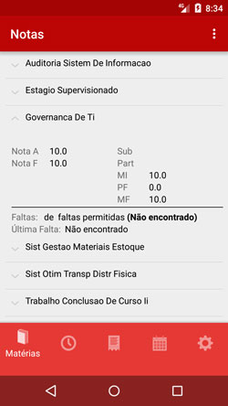

# Macknotas Android
Projeto Android do MackNotas criado em 12/04/15.

Criado utilizando a IDE Android Studio.

## Requisito mínimo:
- Android >= 4.3.3

##  Screenshots:

Para se conectar é necessário ter algum servidor do Parse funcionando. Leia mais em como criar um servidor do Parse para um projeto já existente: [Parse Data Migration](https://parse.com/migration).

## Mais informações do projeto Macknotas [aqui](https://github.com/MackNotas/docs).
